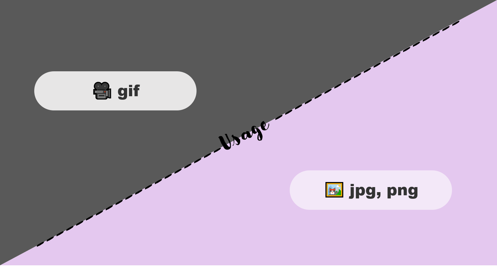

# Project Title

<!--Badges-->
![MIT License][license-shield] ![Repository Size][repository-size-shield] ![Issue Closed][issue-closed-shield]

<!--Project Title Image-->


<!--Project Buttons-->
 [![Readme in Korean][readme-ko-shield]][readme-ko-url] [![View Demo][view-demo-shield]][view-demo-url] [![Report bug][report-bug-shield]][report-bug-url] [![Request feature][request-feature-shield]][request-feature-url]

<!--Table of Contents-->
# Table of Contents
- [[1] About the Project](#1-about-the-project)
  - [Features](#features)
  - [Technologies](#technologies)
- [[2] Getting Started](#2-getting-started)
  - [Prerequisites](#prerequisites)
  - [Installation](#installation)
  - [Configuration](#configuration)
- [[3] Usage](#3-usage)
- [[4] Contribution](#4-contribution)
- [[5] Acknowledgement](#5-acknowledgement)
- [[6] Contact](#6-contact)
- [[7] License](#7-license)


# [1] About the Project
*Provide **general information** about your project describing:*
- ❗️Short❗️ introduction/motivation
- What your project does
- Why people should consider using your project

## Features
*Provide **main features** or **unique features** which you want to emphasize.*
- Provide **guidelines** in *italic* font to help you write aaaaawesome **README** easily.
- Provide **language option** in badge

## Technologies
*List **languages**, **frameworks**, and **major libraries** with their **version**.*
- [Maven](https://maven.apache.org/) 3.6.3
- [MySQL](https://www.mysql.com/) 8.0
- [Spring](https://spring.io/) 2.4.3


# [2] Getting Started
*If your program runs differently depending on the OS, explain how to run it for each OS.*
## Prerequisites
*List software and libraries that you need to run your project and Explain how to get them.*
- [OpenWeather API key](https://openweathermap.org/) for free
- npm
```bash
npm install npm@latest -g
```

## Installation
*Explain how to get your source.*
1. Clone the repository
```bash
git clone https://github.com/your-username/project-repository
```
2. Install NPM packages
```bash
npm install
```

## Configuration
*Explain where to fill your code.*
- Enter Openweather API key in `config.js`
```bash
const API_KEY = "<Your API key>";
```


# [3] Usage
*Show **instructions** and **useful examples** of how your project can be used with **screenshots**, **code examples**, etc. You can make h2 headers for each usage example to clarify your explanation.*



```java
// Show useful code examples of some of your APIs 
```


# [4] Contribution
Any contributions you make are greatly appreciated. Here is the [`contributing guide`][contribution-url].
These are contributors to this project. Thank you!🙆‍♀️
*If you like to use emoji, you can use 🐞 for **fixing bug**, 💡 for **suggestion**, ✨ for creating **new feature***
- 🐞 [dev-ujin](https://github.com/dev-ujin): Fix bug on the main page


# [5] Acknowledgement
*Provide links to **any sources** like **relevant repositories** or **blog posts** that inspired you to build your project.*
- [Readme Template - Embedded Artistry](https://embeddedartistry.com/blog/2017/11/30/embedded-artistry-readme-template/)
- [How to write a kickass Readme - James.Scott](https://dev.to/scottydocs/how-to-write-a-kickass-readme-5af9)
- [Best-README-Template - othneildrew](https://github.com/othneildrew/Best-README-Template#prerequisites)
- [Img Shields](https://shields.io/)
- [Github Pages](https://pages.github.com/)


# [6] Contact
If you want to contact me, you can reach me at:
- 📧 dev.ujin518@gmail.com
- 📋 [https://dev-ujin.github.io/contact](https://dev-ujin.github.io/contact)


# [7] License
This project is licensed under the MIT License. See the [`LICENSE`][license-url] for more information.


<!--Url for Badges-->
[license-shield]: https://img.shields.io/github/license/dev-ujin/readme-template?labelColor=D8D8D8&color=04B4AE
[repository-size-shield]: https://img.shields.io/github/repo-size/dev-ujin/readme-template?labelColor=D8D8D8&color=BE81F7
[issue-closed-shield]: https://img.shields.io/github/issues-closed/dev-ujin/readme-template?labelColor=D8D8D8&color=FE9A2E

<!--Url for Buttons-->
[readme-ko-shield]: https://img.shields.io/badge/-readme%20in%20korean-2E2E2E?style=for-the-badge
[readme-ko-url]: https://github.com/dev-ujin/readme-template/res-readme/README-KO.md
[view-demo-shield]: https://img.shields.io/badge/-%F0%9F%98%8E%20view%20demo-F3F781?style=for-the-badge
[view-demo-url]: https://dev-ujin.github.io
[report-bug-shield]: https://img.shields.io/badge/-%F0%9F%90%9E%20report%20bug-F5A9A9?style=for-the-badge
[report-bug-url]: https://github.com/dev-ujin/readme-template/issues
[request-feature-shield]: https://img.shields.io/badge/-%E2%9C%A8%20request%20feature-A9D0F5?style=for-the-badge
[request-feature-url]: https://github.com/dev-ujin/readme-template/issues

<!--URLS-->
[license-url]: res-readme/LICENSE.md
[contribution-url]: res-readme/CONTRIBUTION.md


